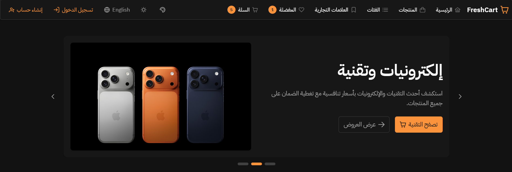

# 🛒 FreshCart - Modern E-Commerce Platform

<div align="center">


**Full-Stack Angular E-Commerce Application**

[](https://angular.dev)
[](https://primeng.org)
[](https://tailwindcss.com)

**Final Project for Route Academy - Frontend Angular Developer Course**

</div>

---

## 📌 Overview

**FreshCart** is a production-ready e-commerce platform built with **Angular 20**, **PrimeNG**, and **Tailwind CSS**. The application delivers a complete shopping experience—from browsing products and managing wishlists to secure checkout with multiple payment methods—while showcasing enterprise-grade Angular development patterns including signal-based state management, comprehensive i18n with RTL support, dynamic theming, and optimized performance architecture.

Developed as the **final project** for [Route Academy](https://www.linkedin.com/company/routeacademy/)'s Frontend Angular Developer course, FreshCart demonstrates real-world e-commerce functionality through standalone components, reactive programming, and a scalable feature-based architecture designed for production environments.

<div align="center">
  <a href="https://angular-ecommerce-v0.vercel.app/" target="_blank">
    
  </a>
</div>

---

## 💫 Interface Preview

<div align="center">
  
  <a href="Docs/ui-screenshots">
    
  </a>
</div>

---

## 🛠️ Tech Stack

<div align="center">

### Frontend Framework
[](https://angular.dev)

### UI & Styling
[](https://skillicons.dev)

### State Management & Utilities
[](https://skillicons.dev)

### Development Tools
[](https://skillicons.dev)

</div>

---

## 🛠️ Built With

- ⚡ **Angular 20.3.0** - Modern reactive framework with standalone components and signals
- 🎨 **PrimeNG 20.2.0** - Enterprise UI component library with 80+ components
- 💨 **Tailwind CSS 4.1.13** - Utility-first CSS framework for rapid UI development
- 🌍 **ngx-translate 17.0.0** - Internationalization library with multi-language support
- 📊 **@ngrx/signals 20.0.1** - Signal-based state management for reactive stores
- 🔄 **RxJS 7.8.0** - Reactive programming library for async operations

---

## ✨ Core Features

<div align="center">

<table>
<tr>
<td align="center"><h3>🛍️</h3></td>
<td><b>Product Catalog</b><br>Browse paginated products, advanced search with filters, product details with image gallery, category & brand filtering</td>
<td align="center"><h3>🛒</h3></td>
<td><b>Shopping Cart</b><br>Add/remove/update items, guest cart with localStorage sync, persistent cart state, real-time badge updates</td>
</tr>
<tr>
<td align="center"><h3>💳</h3></td>
<td><b>Checkout Process</b><br>Cash on delivery & Stripe payment, address selector with saved addresses, order confirmation pages</td>
<td align="center"><h3>❤️</h3></td>
<td><b>Wishlist</b><br>Add/remove favorite products, guest wishlist support, sync on login, visual indicators in product cards</td>
</tr>
<tr>
<td align="center"><h3>🔐</h3></td>
<td><b>Authentication</b><br>JWT-based auth with custom token header, login/register forms with validation, auth guards for protected routes</td>
<td align="center"><h3>👤</h3></td>
<td><b>User Profile</b><br>Dashboard with stats, order history & details, address management, profile & password update</td>
</tr>
<tr>
<td align="center"><h3>🌍</h3></td>
<td><b>Internationalization</b><br>English & Arabic (472+ translations), full RTL/LTR support, runtime language switching, PrimeNG i18n sync</td>
<td align="center"><h3>🎨</h3></td>
<td><b>Theme System</b><br>4 PrimeNG presets (Fresh, Premium, Vibrant, Natural), dark/light mode toggle, runtime theme switching</td>
</tr>
<tr>
<td align="center"><h3>🏷️</h3></td>
<td><b>Categories & Brands</b><br>Category list with subcategories, brand showcase, dedicated detail pages, filter products by category/brand</td>
<td align="center"><h3>📱</h3></td>
<td><b>Responsive Design</b><br>Mobile-first with breakpoints, PrimeNG MenuBar (desktop) & Drawer (mobile), Tailwind responsive utilities</td>
</tr>
<tr>
<td align="center"><h3>⚡</h3></td>
<td><b>Performance</b><br>Lazy-loaded feature routes, OnPush change detection, signal-based stores, optimized with computed signals</td>
<td align="center"><h3>🎯</h3></td>
<td><b>State Management</b><br>Signal stores for cart & wishlist, computed properties for derived state, guest state with localStorage persistence</td>
</tr>
</table>

</div>

---

## 🎨 Theme System

- 🎨 **4 Custom PrimeNG Presets:** Fresh (Teal) • Premium (Indigo) • Vibrant (Orange) • Natural (Emerald)
- 🌓 **Dark/Light Mode:** Each theme supports both color schemes
- ⚡ **Real-time Switching:** Instant theme changes without page reload
- 💾 **Persistent Preferences:** Automatically saves user's theme choice
- 🔄 **RTL Compatible:** Works seamlessly with Arabic layout

---

## 🌐 Internationalization

- 🌍 **Bilingual Support:** English (LTR) and Arabic العربية (RTL)
- 📝 **472+ Translations:** Comprehensive language coverage
- ⚡ **Runtime Switching:** Change language without page reload
- 🎯 **Context-Aware:** Dynamic translations based on application state
- 💾 **Persistent Selection:** Saves user's language preference

---

## 🏗️ Project Structure

```
📦 FreshCart
 ┣ 📂 src
 ┃ ┣ 📂 app
 ┃ ┃ ┣ 📂 core                    # Core functionality
 ┃ ┃ ┃ ┣ 📂 constants             # App-wide constants
 ┃ ┃ ┃ ┣ 📂 guards                # Route guards (auth, guest)
 ┃ ┃ ┃ ┣ 📂 interceptors          # HTTP interceptors
 ┃ ┃ ┃ ┣ 📂 layout                # Layout components (header, footer)
 ┃ ┃ ┃ ┣ 📂 models                # Core data models
 ┃ ┃ ┃ └ 📂 services              # Core services (API, theme, i18n)
 ┃ ┃ ┣ 📂 features                # Feature modules
 ┃ ┃ ┃ ┣ 📂 auth                  # Authentication
 ┃ ┃ ┃ ┣ 📂 products              # Product catalog
 ┃ ┃ ┃ ┣ 📂 cart                  # Shopping cart
 ┃ ┃ ┃ ┣ 📂 checkout              # Checkout process
 ┃ ┃ ┃ ┣ 📂 wishlist              # User wishlist
 ┃ ┃ ┃ ┣ 📂 categories            # Category browsing
 ┃ ┃ ┃ ┣ 📂 brands                # Brand browsing
 ┃ ┃ ┃ ┣ 📂 profile               # User profile
 ┃ ┃ ┃ └ 📂 home                  # Home page
 ┃ ┃ ┣ 📂 shared                  # Shared components & utilities
 ┃ ┃ ┃ ┣ 📂 components            # Reusable components
 ┃ ┃ ┃ ┣ 📂 pipes                 # Custom pipes
 ┃ ┃ ┃ ┣ 📂 validators            # Form validators
 ┃ ┃ ┃ └ 📂 utils                 # Utility functions
 ┃ ┃ ┣ 📂 theme                   # PrimeNG theme presets
 ┃ ┃ ┣ 📜 app.config.ts           # App configuration
 ┃ ┃ ┣ 📜 app.routes.ts           # Route configuration
 ┃ ┃ └ 📜 app.ts                  # Root component
 ┃ ┣ 📂 assets                    # Static assets
 ┃ ┣ 📂 environments              # Environment configs
 ┃ └ 📜 styles.scss               # Global styles
 ┣ 📂 public
 ┃ ┗ 📂 i18n                      # Translation files
 ┃   ┣ 📜 en.json                 # English translations
 ┃   └ 📜 ar.json                 # Arabic translations
 ┣ 📜 angular.json                # Angular CLI config
 ┣ 📜 package.json                # Dependencies
 ┣ 📜 tailwind.config.js          # Tailwind configuration
 └ 📜 tsconfig.json               # TypeScript config
```

---

## 🚀 Getting Started

### Prerequisites

Before you begin, ensure you have the following installed:

- **Node.js**: v18.0.0 or later
- **npm**: v9.0.0 or later (comes with Node.js)
- **Angular CLI**: v20.3.3 or later
  ```bash
  npm install -g @angular/cli
  ```

### Installation

1. **Clone the repository**
   ```bash
   git clone https://github.com/MohamedV0/angular-ecommerce.git
   ```

2. **Navigate to the project directory**
   ```bash
   cd angular-ecommerce
   ```

3. **Install dependencies**
   ```bash
   npm install
   ```

4. **Start the development server**
   ```bash
   npm start
   # or
   ng serve
   ```

5. **Open your browser**
   
   Navigate to `http://localhost:4200/`

> **Note:** The backend API is already configured and provided by Route Academy at `https://ecommerce.routemisr.com/api/v1`. No additional API configuration or keys are required.

---

## 🎓 Learning Outcomes

This project demonstrates proficiency in:

- ✅ **Angular Framework** - Advanced concepts and patterns
- ✅ **TypeScript** - Strong typing and modern features
- ✅ **State Management** - Signals and RxJS
- ✅ **Component Design** - Reusable, composable architecture
- ✅ **Responsive Design** - Mobile-first approach
- ✅ **Internationalization** - Multi-language support
- ✅ **Theming** - Advanced customization
- ✅ **API Integration** - RESTful services
- ✅ **Form Handling** - Reactive forms with validation
- ✅ **Routing** - Lazy loading and guards
- ✅ **Performance** - Optimization techniques
- ✅ **Accessibility** - WCAG compliance

---

<div align="center">
  <p>Developed by <a href="https://github.com/MohamedV0">Mohamed Ashraf</a> as part of <a href="https://www.linkedin.com/company/routeacademy/">Route Academy</a> - Frontend Angular Developer Course</p>
  <p>
    <a href="https://github.com/MohamedV0"></a>
    <a href="mailto:mohamed.ashraf.v0@gmail.com"></a>
    <a href="https://www.linkedin.com/in/mohamed-ashraf-v0/"></a>
    <a href="https://mohamedv0.netlify.app/"></a>
  </p>
</div>
